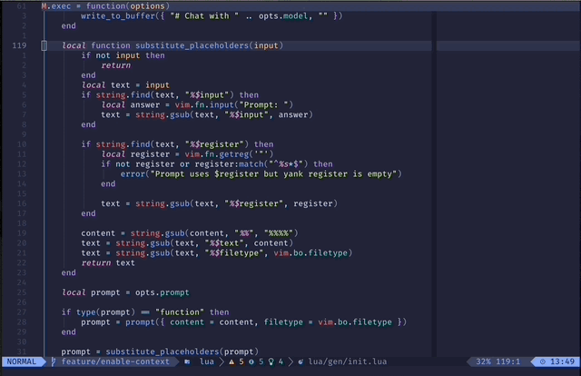

# gen.nvim

Generate text using LLMs with customizable prompts



## Video

[](https://youtu.be/FIZt7MinpMY?si=KChSuJJDyrcTdYiM)


## Requires

- [Ollama](https://ollama.ai/) with an appropriate model, e.g. [`mistral`](https://ollama.ai/library/mistral) or [`zephyr`](https://ollama.ai/library/zephyr) (customizable)
- [Curl](https://curl.se/)

## Install

Install with your favorite plugin manager, e.g. [lazy.nvim](https://github.com/folke/lazy.nvim)

Example with Lazy

```lua
-- Minimal configuration
{ "David-Kunz/gen.nvim" },

```

```lua

-- Custom Parameters (with defaults)
{
    "David-Kunz/gen.nvim",
    opts = {
        model = "mistral", -- The default model to use.
        display_mode = "float", -- The display mode. Can be "float" or "split".
        show_prompt = false, -- Shows the Prompt submitted to Ollama.
        show_model = false, -- Displays which model you are using at the beginning of your chat session.
        no_auto_close = false, -- Never closes the window automatically.
        init = function(options) pcall(io.popen, "ollama serve > /dev/null 2>&1 &") end,
        -- Function to initialize Ollama
        command = "curl --silent --no-buffer -X POST http://localhost:11434/api/generate -d $body",
        -- The command for the Ollama service. You can use placeholders $prompt, $model and $body (shellescaped).
        -- This can also be a lua function returning a command string, with options as the input parameter.
        -- The executed command must return a JSON object with { response, context }
        -- (context property is optional).
        list_models = '<function>', -- Retrieves a list of model names
        debug = false -- Prints errors and the command which is run.
    }
},
```

Here are all [available models](https://ollama.ai/library).

Alternatively, you can call the `setup` function:

```lua
require('gen').setup({
  -- same as above
})
```


## Usage

Use command `Gen` to generate text based on predefined and customizable prompts.

Example key maps:

```lua
vim.keymap.set({ 'n', 'v' }, '<leader>]', ':Gen<CR>')
```

You can also directly invoke it with one of the [predefined prompts](./lua/gen/prompts.lua):

```lua
vim.keymap.set('v', '<leader>]', ':Gen Enhance_Grammar_Spelling<CR>')
```

Once a conversation is started, the whole context is sent to the LLM. That allows you to ask follow-up questions with

```lua
:Gen Chat
```

and once the window is closed, you start with a fresh conversation.

You can select a model from a list of all installed models with

```lua
require('gen').select_model()
```

## Custom Prompts

All prompts are defined in `require('gen').prompts`, you can enhance or modify them.

Example:
```lua
require('gen').prompts['Elaborate_Text'] = {
  prompt = "Elaborate the following text:\n$text",
  replace = true
}
require('gen').prompts['Fix_Code'] = {
  prompt = "Fix the following code. Only ouput the result in format ```$filetype\n...\n```:\n```$filetype\n$text\n```",
  replace = true,
  extract = "```$filetype\n(.-)```"
}
```

You can use the following properties per prompt:

- `prompt`: (string | function) Prompt either as a string or a function which should return a string. The result can use the following placeholders:
   - `$text`: Visually selected text
   - `$filetype`: Filetype of the buffer (e.g. `javascript`)
   - `$input`: Additional user input
   - `$register`: Value of the unnamed register (yanked text)
- `replace`: `true` if the selected text shall be replaced with the generated output
- `extract`: Regular expression used to extract the generated result
- `model`: The model to use, e.g. `zephyr`, default: `mistral`
